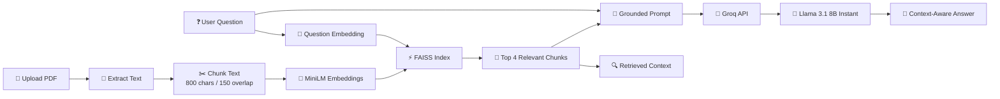
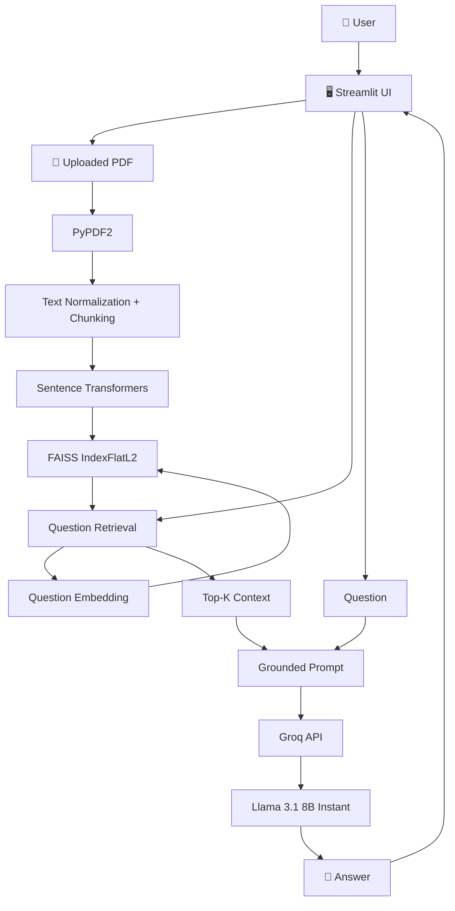

# 📄 AI-Powered PDF Q&A Tool

<p align="center">
  
  
  
  
  
</p>

<p align="center">
  <b>Turn any text-based PDF into an interactive AI knowledge base.</b><br/>
  Upload → retrieve relevant context → ask → get a grounded answer.
</p>

<p align="center">
  <a href="https://github.com/Priyanshu710-ui/-AI-Powered-PDF-Q-A-Tool"><strong>⭐ Star this repo</strong></a>
  &nbsp;•&nbsp;
  <a href="https://github.com/Priyanshu710-ui/-AI-Powered-PDF-Q-A-Tool/issues">🐛 Issues</a>
</p>

---

## 🔥 What Is This?

**AI-Powered PDF Q&A Tool** is a lightweight **Retrieval-Augmented Generation (RAG)** application that lets you talk to a PDF.

Instead of asking an LLM to process an entire document at once, the app builds a searchable representation of the uploaded PDF, finds the most relevant passages for each question, and then gives those passages to the language model as context.

> 💡 **Core principle:** retrieve the right information first, generate the answer second.

---

## ✨ Features

| Feature | Description |
|---|---|
| 📤 **PDF Upload** | Upload a PDF directly from the Streamlit UI |
| 📖 **Text Extraction** | Read text from every PDF page with PyPDF2 |
| ✂️ **Chunking** | Split content into 800-character chunks with 150-character overlap |
| 🧠 **Local Embeddings** | Convert document chunks into semantic vectors with `all-MiniLM-L6-v2` |
| ⚡ **FAISS Search** | Perform fast local vector similarity search |
| 🎯 **Top-K Retrieval** | Retrieve the 4 most relevant chunks for each question |
| 🤖 **LLM Answers** | Generate grounded answers with Llama 3.1 through Groq |
| 🔍 **Context Viewer** | Inspect the exact retrieved chunks used for the answer |
| 💾 **Session Persistence** | Keep the indexed document available during the current Streamlit session |
| 🔐 **Secure Input UI** | Groq API key is entered through a password field |

---

## 🧠 RAG Pipeline



---

## 🏗️ Architecture



---

## 🔄 How It Works

### 1️⃣ Upload the PDF

The user uploads a document through Streamlit's file uploader.

### 2️⃣ Extract text

`PyPDF2` reads each page and combines the readable text into a normalized string.

### 3️⃣ Chunk the document

The extracted text is split into **800-character chunks** with a **150-character overlap**. The overlap helps prevent important context from being lost at chunk boundaries.

### 4️⃣ Generate embeddings

Each chunk is embedded locally using:

```text
all-MiniLM-L6-v2
```

### 5️⃣ Build the vector index

The embeddings are added to a:

```text
FAISS IndexFlatL2
```

This becomes the document's searchable semantic index.

### 6️⃣ Ask a question

The user's question is embedded using the same embedding model.

### 7️⃣ Retrieve relevant context

FAISS returns the **4 closest document chunks** based on vector distance.

### 8️⃣ Generate the answer

The retrieved chunks and question are inserted into a grounded prompt and sent to:

```text
Groq → Llama 3.1 8B Instant
```

### 9️⃣ Inspect the context

The UI exposes the retrieved chunks so the user can see what information was supplied to the model.

---

## 🎯 Grounded Generation

The answer-generation prompt tells the model to use **only the supplied document context**.

When the required information is missing, the application asks the model to return:

```text
I couldn't find that in the document.
```

This makes the system behave like a **document assistant** instead of a free-form chatbot.

---

## 🛠️ Tech Stack

| Technology | Role |
|---|---|
| 🐍 **Python** | Application logic |
| 🎈 **Streamlit** | Web UI |
| 📄 **PyPDF2** | PDF text extraction |
| 🧠 **Sentence Transformers** | Local embeddings |
| ⚡ **FAISS** | Vector similarity search |
| 🤖 **Groq** | LLM inference |
| 🦙 **Llama 3.1 8B Instant** | Answer generation |
| 🔢 **NumPy** | Numerical/vector processing |

### ⚙️ Current Configuration

```text
Embedding Model : all-MiniLM-L6-v2
LLM Model       : llama-3.1-8b-instant
Chunk Size      : 800 characters
Chunk Overlap   : 150 characters
Top-K Retrieval : 4 chunks
Temperature     : 0.2
Max Tokens      : 500
```

---

## 📂 Project Structure

```text
-AI-Powered-PDF-Q-A-Tool/
│
├── 📄 app.py                  # Main Streamlit application
├── 📦 app/                    # Supporting app resources
├── 🖼️ screenshots/            # Screenshots / demo assets
├── ⚙️ env.example              # Environment variable template
├── 📋 requirements.txt         # Python dependencies
├── 📦 package.json             # Project metadata
├── 🚫 .gitignore
└── 📘 README.md
```

---

## 🚀 Run Locally

### Prerequisites

- Python 3.x
- Git
- Groq API key

### 1. Clone the repository

```bash
git clone https://github.com/Priyanshu710-ui/-AI-Powered-PDF-Q-A-Tool.git
cd -AI-Powered-PDF-Q-A-Tool
```

### 2. Create and activate a virtual environment

**Windows**

```bash
python -m venv venv
venv\Scripts\activate
```

**macOS / Linux**

```bash
python3 -m venv venv
source venv/bin/activate
```

### 3. Install dependencies

```bash
pip install -r requirements.txt
```

### 4. Launch the app

```bash
streamlit run app.py
```

### 5. Add your Groq API key

Open the Streamlit app, enter your Groq API key in the sidebar, upload a PDF, and start asking questions.

---

## 📦 Dependencies

The project currently pins its main dependencies for a reproducible local setup:

```text
streamlit==1.38.0
PyPDF2==3.0.1
sentence-transformers==3.0.1
faiss-cpu==1.8.0
groq==1.6.0
numpy==1.26.4
```

---

## 🔐 API Key & Security

The app accepts the Groq key through a password-style input field.

**Never commit a real API key to GitHub.** Use the supplied environment template for reference and keep secrets outside version control.

```text
GROQ_API_KEY=your_api_key_here
```

> ⚠️ If a real key is ever exposed, revoke/rotate it immediately.

---

## 🖼️ Screenshots

Demo assets are stored in [`screenshots/`](./screenshots).

Add your preferred screenshot files here using GitHub-relative paths, for example:

```md

```

---

## 🧪 Example Questions

Once a PDF is indexed, try questions such as:

```text
What is the main objective of this document?
```

```text
Summarize the key findings.
```

```text
What methodology was used?
```

```text
What conclusions does the author reach?
```

```text
Which technologies or tools are mentioned?
```

The system works best when the requested information is actually present in the uploaded document.

---

## ⚡ Why Local Embeddings + FAISS?

One of the most interesting design choices is the split between **local retrieval** and **remote generation**.

```text
┌──────────────────────────────┐
│           LOCAL              │
├──────────────────────────────┤
│ PDF → Text → Chunks          │
│          ↓                   │
│ MiniLM Embeddings            │
│          ↓                   │
│ FAISS Similarity Search      │
└──────────────┬───────────────┘
               │
               ▼
┌──────────────────────────────┐
│           REMOTE             │
├──────────────────────────────┤
│ Question + Retrieved Context │
│            ↓                 │
│        Groq / Llama          │
│            ↓                 │
│          Answer              │
└──────────────────────────────┘
```

This keeps the document-search layer simple and local while using an LLM specifically for the final natural-language response.

---

## 📌 Current Limitation

The current implementation depends on standard PDF text extraction through PyPDF2.

```text
Text-based PDF       ✅
Scanned/image-only PDF ⚠️ OCR required
```

A scanned PDF without an OCR text layer may therefore produce little or no searchable content.

---

## 🔮 Roadmap

- [ ] 📚 Multi-PDF conversations
- [ ] 🔗 Source citations with page numbers
- [ ] 💬 Persistent chat history
- [ ] 🗂️ Document history
- [ ] 📸 OCR for scanned PDFs
- [ ] 📑 Page-aware chunking
- [ ] 💾 Persistent FAISS indexes
- [ ] 📤 Export conversations
- [ ] 🧪 Retrieval/answer evaluation
- [ ] ☁️ Production deployment configuration

---

## 🧠 What This Project Demonstrates

This project brings together several practical AI engineering concepts:

**RAG • semantic search • embeddings • vector databases/indexes • prompt grounding • LLM inference • PDF processing • Python • Streamlit**

It shows how a traditional document-processing pipeline can be combined with modern generative AI to create a useful, interactive application.

---

## 👨‍💻 Author

<p align="center">
  <b>Priyanshu</b><br/>
  AI • ML • Full-Stack Development • Developer Tools
</p>

<p align="center">
  <a href="https://github.com/Priyanshu710-ui">GitHub</a>
  &nbsp;•&nbsp;
  <a href="https://leetcode.com/u/Priyanshu710-ui/">LeetCode</a>
</p>

---

## ⭐ Show Some Love

If this project helped you, taught you something, or you simply liked it:

**⭐ Star the repository and check out the code!**

<p align="center">
  <b>📄 Upload. 🔎 Retrieve. 🤖 Ask. 💬 Understand.</b>
</p>
