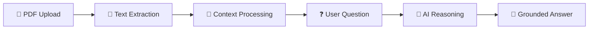
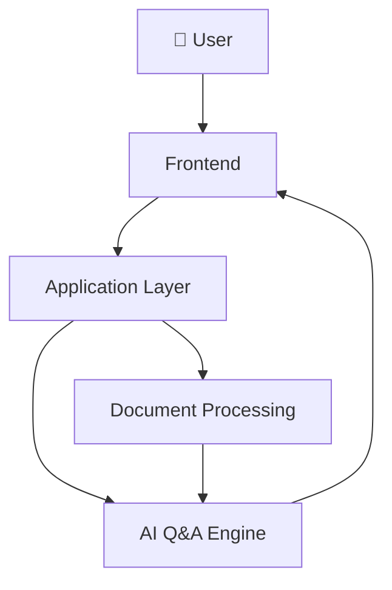
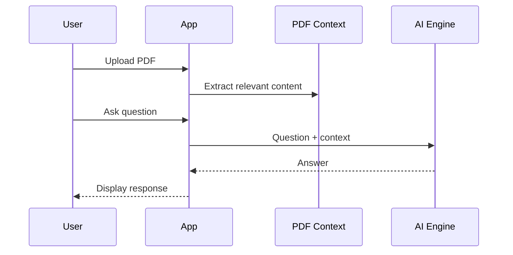
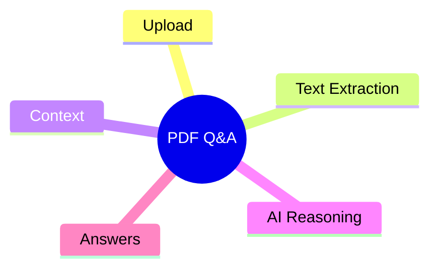

# 📄 AI-Powered PDF Q&A Tool

> Upload a document, ask a question, and get AI-assisted answers from your content.


## 🧠 Document Intelligence Pipeline


## 🏗️ Architecture


## 🔄 Question Flow


## 🗺️ Feature Map


## 📂 Project Blueprint
```text
├── app.py
├── app/
├── requirements.txt
├── package.json
├── screenshots/
└── env.example
```

---

### 👨‍💻 Created by **Priyanshu**
