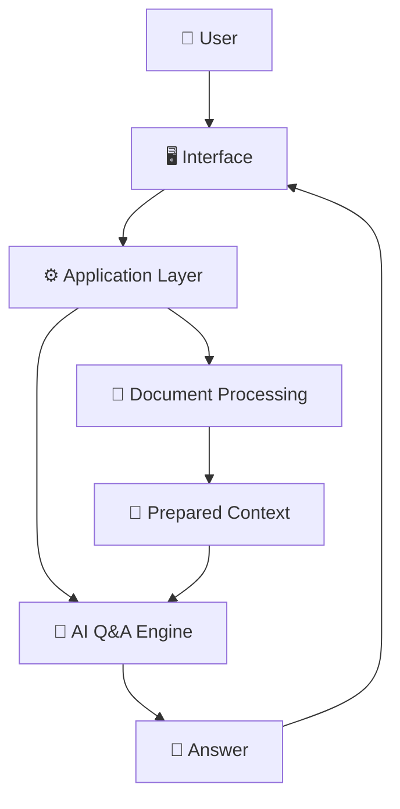
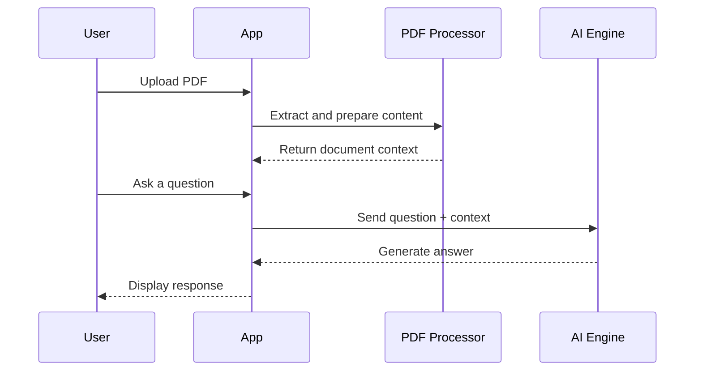
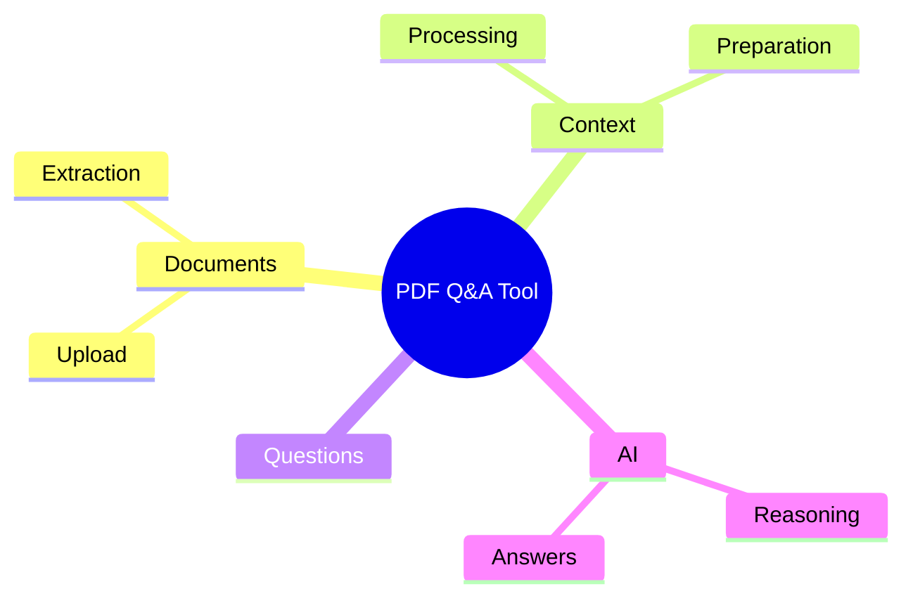

# 📄 AI-Powered PDF Q&A Tool

<p align="center"><b>Upload a PDF, ask questions about its contents, and receive AI-assisted answers based on processed document context.</b></p>

<p align="center">


</p>

---

## ✨ Overview

**AI-Powered PDF Q&A Tool** is built around a document-intelligence workflow. A user uploads a PDF, the application extracts and prepares usable content, and questions can then be processed alongside that document context to generate an AI-assisted answer.

The central idea is to make a document easier to explore through a conversational flow instead of manually searching through every page.

## 🚀 Features

- 📤 Upload PDF documents
- 📖 Extract usable document text/content
- 🧩 Prepare context for question answering
- ❓ Ask questions about the uploaded material
- 🧠 AI-assisted response generation
- 💬 Display answers through the application interface

## 🧠 Document Intelligence Pipeline


## 🏗️ Architecture



## 🔄 Question Lifecycle



## ⚙️ How It Works

1. Upload a PDF document.
2. The application extracts usable content from the file.
3. That content is prepared as context for the Q&A workflow.
4. Enter a question related to the document.
5. The application combines the question with available context.
6. The AI layer generates a response that is returned to the interface.

## 📂 Project Structure

```text
AI-Powered-PDF-Q-A-Tool/
├── app.py
├── app/
├── requirements.txt
├── package.json
├── screenshots/
└── env.example
```

## 🛠️ Tech Stack

| Area | Role |
|---|---|
| Python | Application and processing logic |
| PDF Processing | Document text/content extraction |
| AI | Context-aware question answering |
| Web/UI | Upload and question interaction |

## 🚀 Installation

```bash
git clone https://github.com/Priyanshu710-ui/-AI-Powered-PDF-Q-A-Tool.git
cd -AI-Powered-PDF-Q-A-Tool
```

Install the dependencies defined by the project and configure any required environment variables using the included environment template.

## 🎯 Use Cases

- 📚 Study and revision from notes or PDFs
- 🔬 Faster exploration of research documents
- 📄 Interactive document assistance
- 💼 Internal knowledge-document Q&A prototypes

## 🗺️ Feature Map



## 🔮 Roadmap

- [ ] Support multiple documents in one session
- [ ] Add document history
- [ ] Add source/page references in answers
- [ ] Add exportable conversations
- [ ] Improve large-document handling

---

### 👨‍💻 Created by **Priyanshu**

⭐ If you like the project, consider starring the repository!
